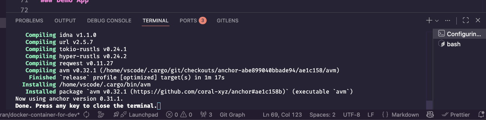

# Fogo Sessions

Next-gen on-chain experience on Fogo.

<p>
  <a href="https://github.com/fogo-foundation/fogo-sessions/blob/main/LICENSE">
    <picture>
      <source media="(prefers-color-scheme: dark)" srcset="https://img.shields.io/badge/license-APACHE-blue.svg?color=green">
      
    </picture>
  </a>
</p>

Fogo Sessions is an open-source standard for Web3 app sessions on Fogo.

Fogo Sessions helps Fogo app developers to provide a great user experience to their users by:

- enabling their apps to be used with any Solana wallet (even those that don't support Fogo!)
- enabling gasless transactions. No more sending some dust to your address to rescue stranded funds!
- reducing the number of times the user needs to sign with their browser wallet. They only need to sign once to log in!

## Getting Started

To jump straight to examples, go to [here](https://github.com/fogo-foundation/fogo-sessions/tree/main/programs/example) for an example program compatible with Fogo Sessions and [here](https://github.com/fogo-foundation/fogo-sessions/tree/main/apps/sessions-demo) for an app that interacts with that example program. To run this app locally, follow the intructions in the **Development** section below.

## Packages

> [!NOTE]
> This is a developer preview. Non-major version bumps may contain breaking changes.

| Package                    | Description                                                            | Version                                                                                                                                |
| :------------------------- | :--------------------------------------------------------------------- | :------------------------------------------------------------------------------------------------------------------------------------- |
| `fogo-sessions-sdk`        | Rust utilities for writing SVM programs compatible with Fogo Sessions  | [](https://crates.io/crates/fogo-sessions-sdk)                 |
| `@fogo/sessions-sdk`       | TypeScript utilities for integrating with Fogo sessions                | [](https://www.npmjs.com/package/@fogo/sessions-sdk)             |
| `@fogo/sessions-sdk-web`   | Framework-agnostic utilities for integrating with Fogo sessions on web | [](https://www.npmjs.com/package/@fogo/sessions-sdk-web)     |
| `@fogo/sessions-sdk-react` | React components and hooks for integrating with Fogo sessions          | [](https://www.npmjs.com/package/@fogo/sessions-sdk-react) |

## Development

### Toolchain requirements

The Fogo Sessions repository requires the following toolchain versions:

- `nodejs@22.21.1`
- `pnpm@10.13.1`
- `rust@1.88.0`
- `python@3.14.0`

For convenience, there is a `.tool-versions` file that contains a mapping of these tools to the correct versions.
This file works great with [mise](https://mise.jdx.dev/).
If you already have `mise` installed, simply do `mise x -- pnpm i` to get started.
However, it's recommended to do your local development in a [devcontainer](https://containers.dev) to keep your personal computer free from toolchain bloat and potential version mismatches.
Please refer to the documentation, below 👇

### Developing in a [devcontainer](https://containers.dev)

#### Prerequisites

- [Docker Desktop](https://docs.docker.com/desktop/) for your OS
- (If using VSCode) VSCode has first-class support for DevContainers via its official [Dev Containers extension](https://marketplace.visualstudio.com/items?itemName=ms-vscode-remote.remote-containers).
  - NOTE: Other IDEs have Dev Container support, but this guide only covers VSCode.

#### Launching your devcontainer

1. Ensure Docker desktop is running
2. Open this workspace in VSCode. It should automatically detect the `devcontainer` configuration and prompt you to re-open the repo as a `devcontainer`. If it does not, open the VSCode command palette and type `dev containers: rebuild and reopen` and select the first option.
3. Wait until your `devcontainer` is setup (you will see a terminal at the bottom of the VSCode window say **press any key to close the terminal**, see image below)
   - 
4. All of the correct toolchain versions needed to build and run things in this repo are installed and you are ready to go! Any edits you make while in the `devcontainer` will also be written to disk outside of the `devcontainer`, allowing you to continue using `git` for operations outside of the container.
5. (Optional) If you prefer to run CLI commands in a terminal outside of the VSCode IDE, you can do so by grabbing the container ID from docker via `docker ps`, then running the following:
   - `docker exec -it <CONTAINER_ID> bash`
   - `cd /workspaces/fogo-sessions` to enter the folder where the project is hosted in the `devcontainer`

### Demo App

```
tilt up # Starts local test validators, starts demo app
```

### Programs

```
cargo-build-sbf # Build on-chain programs
```

### Tests

```
pnpm turbo test # Run app tests
cargo test # Run program tests
```

You may need to run `anchor build` before running `cargo test`, in order to generate the compiled programs needed for some tests that load those programs in via litesvm.
